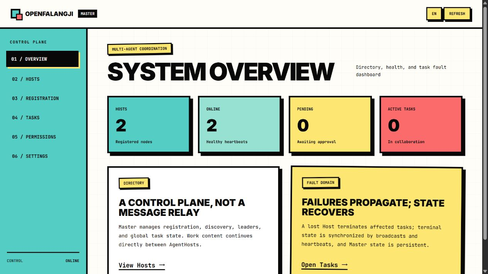
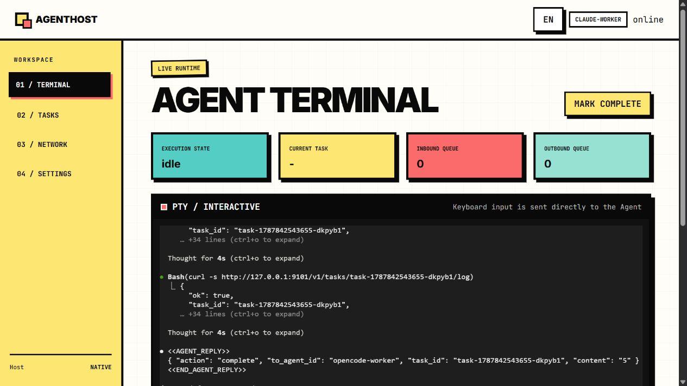

# OpenFalangji / 开放法朗吉

[English](#english) | [中文](#中文)

一个本地优先的多 Agent 协调平台。OpenFalangji 将各类终端式 Agent（例如 Claude Code、OpenCode、Codex 与 Pi）放入独立的 AgentHost 中，由 Master 提供注册、发现、权限和任务状态控制面。Agent 间的业务消息仍然点对点传递，Master 不成为内容中转站。





## 中文

### 架构与工作方式

#### 名称与组织隐喻

**OpenFalangji** 的命名灵感来自法国空想社会主义者夏尔·傅立叶（Charles Fourier）的 **phalanstère**。这个词由 *phalange*（协作群体/方阵）与 *monastère*（共同体居所）构成；其中 *phalange* 指向由具有不同能力的成员构成、共同劳动的协作单元。我们借用的是“多个自主单元在共同规则下协作”的意象，而非复刻其历史制度。法兰西学院词典将 *phalanstère* 定义为傅立叶设想的生产与消费合作社；其词源正是 *phalange* 与 *monastère* 的组合。[法兰西学院词典](https://www.dictionnaire-academie.fr/article/A9P1896)

从软件架构看，项目也有明显的**微服务式组织方式**：每个 AgentHost 都是独立运行、独立持久化、拥有明确边界的自治节点；Master 类似控制面，负责注册、发现、权限和全局状态，而不承载业务消息本身。不同于传统微服务的是，这里的“服务”是具备推理能力、可选择继续、转发、创建新任务或结束任务的 Agent。

```text
浏览器 ──> Master :9300 ──> 注册审批 / 邻居发现 / 权限 / 全局任务状态
                   │
                   ├──────── AgentHost A :9101 ──> Claude Code
                   └──────── AgentHost B :9102 ──> OpenCode / Codex / Pi

AgentHost A <──────────── 任务、回复和转发（P2P）────────────> AgentHost B
```

- **Master** 是控制面：保存 Host 注册、心跳、可见性权限、Leader 标记与全局任务状态；其状态持久化在 `master/.data/master-state.json`。
- **AgentHost** 是单个 Agent 的运行时：托管 PTY 终端、浏览器控制台、任务入/出队列、任务持久化和完成检测。
- **任务模式** 用共享 `task_id` 协作。`forward` 继续同一任务，`complete` 结束当前任务，`create` 可另建任务，并由 `end_current` 决定是否结束旧任务。
- **完成检测器** 从 Agent 自己的历史记录中识别最终回复，避免只解析 TUI 的原始终端输出。内置 OpenCode、Claude Code、Codex、Pi、手动和自定义 Reader。
- 两个控制台均支持中文/English 切换，首次访问默认中文，选择保存在浏览器本地存储中。

### 前置条件

- Node.js 22+（`node:sqlite` 用于 OpenCode 检测）。
- Windows 上构建 `node-pty` 可能需要 Visual Studio C++ Build Tools；Linux/macOS 则需要常规编译工具链。
- 需要运行相应 Agent CLI，并确保其在 Host 所启动的终端环境中可执行。
- 使用 WSL 时，安装并至少启动一次目标发行版。

### 安装

```bash
git clone https://github.com/doc66666/OpenFalangji.git
cd OpenFalangji
cd master && npm install
cd ../agent-host && npm install
```

### 启动一个 Master、两个 Host（无 Leader）

在三个终端分别运行：

```bash
# 终端 1
cd master
npm start -- --port 9300

# 终端 2：Windows 原生 Claude Code
cd agent-host
node src/index.js --agent-id claude-worker --port 9101 --center-url http://127.0.0.1:9300 --mode task --terminal-env native --description "Claude Code worker" --capability coding

# 终端 3：由 Windows Host 启动 WSL 内的 OpenCode
cd agent-host
node src/index.js --agent-id opencode-worker --port 9102 --center-url http://127.0.0.1:9300 --mode task --terminal-env wsl --description "OpenCode worker" --capability coding
```

打开：Master `http://127.0.0.1:9300`、Claude Host `http://127.0.0.1:9101`、OpenCode Host `http://127.0.0.1:9102`。在 Master 的“注册审批”页面批准 Host；不设置任何 Host 为 Leader 即可保持无 Leader 的普通协作模式。也可在 Host 的“运行设置”页配置命令、工作目录、检测器和 WSL 发行版。

### 测试

```bash
cd master && npm test
cd ../agent-host && npm test
```

测试包含任务持久化、任务 ID 路由隔离、Claude 提交、Windows 原生 PTY 与 Windows Host 启动 WSL PTY 的基础验证。

### 重要注意事项

1. **模型能力与 Prompt 决定上限。** 平台只负责可靠地交接、记录和路由；模型是否正确理解任务、何时结束、是否产生合规回复，仍受模型本身和 Prompt 质量限制。
2. **强烈建议运行环境一致。** 同一协作组尽量统一 Windows 原生、WSL 或 Linux，并统一工作目录与 Agent CLI 版本。混用环境会使日志文件位置、用户目录和路径表示不同。
3. **Windows + WSL 示例。** WSL 中的 OpenCode 会把 Windows 工作目录记录为 `/mnt/d/...`，而 Windows Host 看到的是 `D:\...`。项目已为 OpenCode 处理该映射，并通过 `\\wsl.localhost\<发行版>` 读取 WSL 数据库快照；其他 Agent 的跨环境日志目录仍应在部署前逐一验证。
4. **本地地址并非总是双向可达。** 默认 WSL2 NAT 下，Windows 访问 WSL 服务通常可使用 `localhost`；WSL 访问 Windows 服务是否能使用 `localhost` 取决于 WSL 网络模式。若日志读取必须跨边界，请按 WSL 网络配置使用 Windows 主机 IP 或 mirrored networking。
5. **安全边界。** 当前默认监听 `127.0.0.1`。跨机器部署前，务必加入认证、TLS、访问控制及来源校验；不要把带有 Agent 权限的 Host 直接暴露到公网。
6. **注册审批与持久化。** 重启 Host 会产生注册申请；批准后才会恢复队列。Master 与 AgentHost 都有本地状态文件，升级前应保留这些目录或明确迁移。

---

## English

### Architecture and flow

OpenFalangji is a local-first coordination platform for terminal-based agents such as Claude Code, OpenCode, Codex, and Pi.

#### Name and organisational metaphor

**OpenFalangji** takes inspiration from Charles Fourier's **phalanstère**, a term formed from *phalange* (a cooperative group or phalanx) and *monastère* (a communal residence). In Fourier's vocabulary, a *phalange* evokes people with different capacities working as an associated unit. We borrow the image of autonomous units cooperating under shared rules; the project does not attempt to reproduce the historical system. The Académie française describes the *phalanstère* as Fourier's cooperative society of production and consumption and records its derivation from *phalange* and *monastère*. [Académie française dictionary](https://www.dictionnaire-academie.fr/article/A9P1896)

The platform also resembles a **microservice-style organisation**. Each AgentHost is an independently running, persistent, bounded autonomous node. Master acts as a control plane for registration, discovery, permissions, and global task state instead of carrying work messages. Unlike conventional microservices, these nodes are reasoning Agents that can decide whether to continue, forward, create a task, or complete it.

- **Master** is the control plane. It owns Host registration, heartbeats, discovery permissions, Leader markers, and global task state. State is persisted in `master/.data/master-state.json`.
- **AgentHost** is an individual agent runtime. It owns the PTY, browser console, task queues, task persistence, and completion detection.
- In **task mode**, `forward` continues the same `task_id`, `complete` ends it, and `create` starts a new task with explicit control over whether the current task ends.
- Agent work content travels directly between AgentHosts. Master is deliberately not a message relay.
- Both consoles have a Chinese/English switch. Chinese is the default for first-time visitors; the choice is stored locally in the browser.

### Requirements

- Node.js 22+ for the OpenCode SQLite detector.
- A working CLI for every Agent you plan to run.
- Build tools for `node-pty` when your platform requires compilation.
- WSL installed and initialized if a Windows Host will launch an Agent inside WSL.

### Install and run

```bash
git clone https://github.com/doc66666/OpenFalangji.git
cd OpenFalangji
cd master && npm install
cd ../agent-host && npm install
```

Run one Master and two non-Leader Hosts in separate terminals:

```bash
# Master
cd master && npm start -- --port 9300

# Native Windows Claude Code Host
cd agent-host
node src/index.js --agent-id claude-worker --port 9101 --center-url http://127.0.0.1:9300 --mode task --terminal-env native --description "Claude Code worker" --capability coding

# Windows Host that launches OpenCode in WSL
cd agent-host
node src/index.js --agent-id opencode-worker --port 9102 --center-url http://127.0.0.1:9300 --mode task --terminal-env wsl --description "OpenCode worker" --capability coding
```

Open Master at `http://127.0.0.1:9300`, then approve the Host registration requests. Open the Host consoles on ports `9101` and `9102`. Do not mark a Host as Leader for ordinary leaderless collaboration.

### Test

```bash
cd master && npm test
cd ../agent-host && npm test
```

### Operational notes

1. **Model capability and prompt quality are the limiting factors.** The platform can route and preserve work, but it cannot make an Agent understand an ambiguous task or choose a correct completion state.
2. **Keep runtime environments consistent whenever possible.** Prefer one environment (native Windows, WSL, or Linux), one workspace convention, and aligned CLI versions across a collaborating group.
3. **Windows/WSL paths require care.** A WSL OpenCode session may store `/mnt/d/...` while its Windows Host sees `D:\...`. OpenCode handles this mapping and reads through `\\wsl.localhost\<distro>` snapshots. Validate the log locations of other detectors before relying on mixed environments.
4. **`localhost` is not automatically symmetric across WSL2 NAT.** Windows-to-WSL commonly works through localhost; WSL-to-Windows behavior depends on the WSL networking mode. Use the Windows host IP or mirrored networking when cross-boundary log access is required.
5. **Secure any non-local deployment.** Add authentication, TLS, access control, and origin validation before exposing Master or a Host beyond loopback.

## License

No license has been selected yet. Add one before distributing the project.
